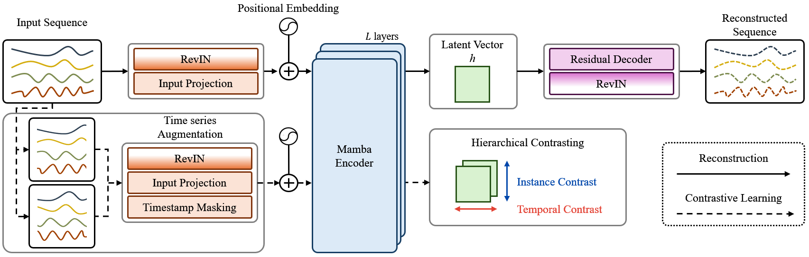
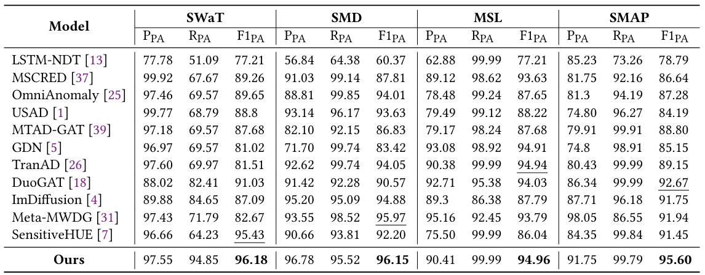

# SensitiveMamba: Time Series Anomaly Detection Using Contrastive Learning and Mamba


## SensitiveMamba



## Get Started!
1. Install Python 3.10 and the required packages in `requirements.txt`.

### 🛠️ Preprocess the data
```bash
# SWaT
python preprocess.py --config_path ./config/star.yaml --data_name SWaT
# SMD
python preprocess.py --config_path ./config/star.yaml --data_name SMD
# MSL
python preprocess.py --config_path ./config/star.yaml --data_name MSL
# SMAP
python preprocess.py --config_path ./config/star.yaml --data_name SMAP
```


### 🚀 Train and evaluate

```bash
# SWaT
python main.py --config_path ./config/star.yaml --data_name SWaT
# SMD
python main.py --config_path ./config/star.yaml --data_name SMD
# MSL
python main.py --config_path ./config/star.yaml --data_name MSL
# SMAP
python main.py --config_path ./config/star.yaml --data_name SMAP
```


## Results



## Acknowledgement 

We are grateful for the following awesome projects when implementing S-Mamba:

- [SensitiveMamba](https://github.com/yuesuoqingqiu/SensitiveHUE)
- [Mamba](https://github.com/state-spaces/mamba)